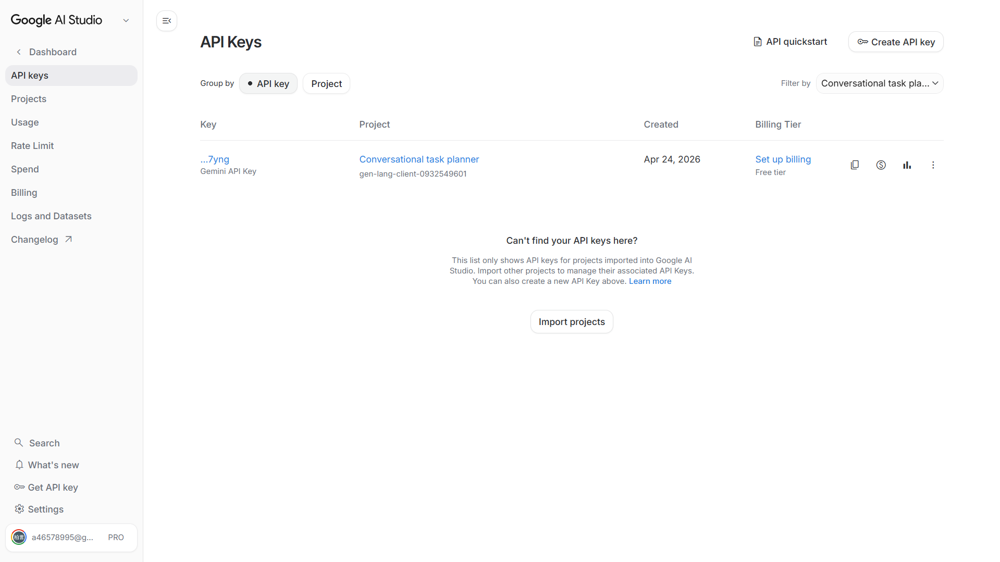
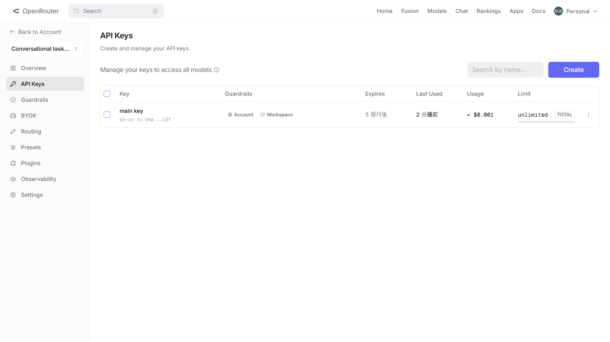

# AI 設定方式

更新日期時間：2026-04-26 13:20:00

本文件用於說明如何完成 AI 服務設定、啟動與接通測試。

---

## 文件目的

本文件提供組員完成以下工作的最小操作流程：

- 了解目前支援的 AI Provider
- 建立個人 API Key
- 完成本機 AI 環境設定
- 啟動 backend 並測試 AI 是否接通

---

## 使用前提

開始前，請先確認 [quick_start.md](./quick_start.md) 已可正常完成。

至少應具備以下條件：

- `.venv` 已建立
- frontend 與 backend 套件已安裝且正常啟動
- 能在本機執行 PowerShell 指令

若 `quick_start.md` 尚未完成，請先完成基礎環境設定，再進行本文件中的 AI 設定。

---

## 支援的 AI Provider

目前系統支援兩個 AI Provider：

### AI Studio

AI Studio 為 Google 提供的生成式 AI 服務介面，目前在本專案中作為主要 Provider 使用。AI 請求會優先使用 AI Studio 執行。

### OpenRouter

OpenRouter 為聚合式 AI Provider 入口，可透過單一介面連接多種模型來源。目前在本專案中作為備援 Provider 使用，當 AI Studio 無法使用時，可作為替代路徑。

---

## API Key 建立方式

本專案要求每位組員使用自己的 API Key，不共用金鑰。

### AI Studio

1. 前往 Google AI Studio 管理介面
2. 使用個人帳號建立 AI Studio 專案
3. 在專案中建立 API 金鑰
4. 保存建立完成的金鑰內容

完成結果：



### OpenRouter

1. 前往 OpenRouter 管理介面
2. 使用個人帳號建立 OpenRouter 專案
3. 在專案中建立 API 金鑰並設定金鑰有效時間
4. 保存建立完成的金鑰內容

完成結果：



---

## 本機環境設定

### 1. 建立 `.env`

專案中已提供：

- `backend/.env.example`

請依此手動建立檔案：

- `backend/.env`

並填入自己的 API Key：

```env
AI_STUDIO_API_KEY=你的_ai_studio_key
OPENROUTER_API_KEY=你的_openrouter_key
```

若只需要最小測試，可以先只填 AI Studio 金鑰 `AI_STUDIO_API_KEY`。

### 2. 模型設定位置

AI Provider 與模型設定集中於：

- `backend/app/services/ai_service/model_config.yaml`

一般組員不需要修改此檔案；若沒有模型切換或測試需求，請維持既有設定。

---

## 啟動與測試方式

### 1. 啟動 backend

於專案根目錄執行：

```powershell
npm run dev:backend
```

backend 啟動後，預設網址為：

```text
http://127.0.0.1:8000/
```

### 2. 測試 AI 是否接通

本專案已提供基本 AI 接通測試：

- `tests/backend/test_ai_connectivity.py`

可於專案根目錄執行：

```powershell
.\.venv\Scripts\python.exe -m pytest tests/backend/test_ai_connectivity.py -q
```

若由 AI 代理代跑此測試，需允許對外連線權限，否則可能無法完成真實 Provider 接通驗證。

常見結果如下：

- `2 passed`
  - 代表 AI Studio 與 OpenRouter 兩個 Provider 都已基本接通成功
- `1 passed, 1 skipped`
  - 代表其中一個 Provider 已完成接通測試，另一個 Provider 因 API Key 未設定而被略過
- `2 skipped`
  - 代表兩個 Provider 的接通測試都被略過，通常是因為尚未完成必要的 API Key 設定
- `1 passed, 1 failed`
  - 代表其中一個 Provider 接通成功，另一個 Provider 接通失敗
- `2 failed`
  - 代表 AI Studio 與 OpenRouter 兩個 Provider 都尚未接通，或目前環境設定仍有問題

各別測試指令：

```powershell
.\.venv\Scripts\python.exe -m pytest tests/backend/test_ai_connectivity.py -q -k ai_studio
.\.venv\Scripts\python.exe -m pytest tests/backend/test_ai_connectivity.py -q -k openrouter
```

### 3. 補充：手動查看 AI 回覆內容

若只是想手動查看 AI 實際回了什麼，可使用臨時測試腳本：

- `tools/test-ai-api.ps1`

例如：

```powershell
pwsh -NoProfile -File .\tools\test-ai-api.ps1
```

這個腳本比較適合：

- 手動查看 AI 回覆內容
- 臨時確認 `/api/ai-test` 的回傳結果

它不是本專案主要的正式接通測試方式。

---

## 常見問題

### 1. `.env` 已建立，但仍顯示缺少 API Key

請確認：

- 檔案位置是 `backend/.env`
- 變數名稱正確
- backend 已重新啟動

### 2. 顯示 `PyYAML is required to load AI model configuration`

表示目前 backend 執行環境缺少 `PyYAML`。請確認套件有安裝在 `.venv` 中，並優先使用：

```powershell
npm run install:backend
```

或：

```powershell
.\.venv\Scripts\python.exe -m pip install -r backend/requirements.txt
```

### 3. 顯示無法連線或 `[WinError 10061]`

這通常表示 backend 尚未啟動。請先確認：

- `npm run dev:backend` 已成功執行
- `http://127.0.0.1:8000/api/ping` 可正常回應

### 4. PowerShell 顯示中文亂碼

若使用 Windows PowerShell 5.1，可能會遇到編碼問題。建議優先使用：

```powershell
pwsh
```

也就是 PowerShell 7。

### 5. OpenRouter 無法使用，但 AI Studio 正常

請優先確認：

- `OPENROUTER_API_KEY` 是否正確
- OpenRouter 帳號是否有可用額度

若目前只需測試主線 Provider，可先以 AI Studio 是否接通為主。
