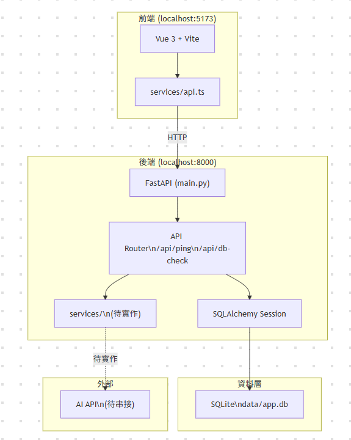

# 系統架構文檔

更新日期時間：2026-04-16 21:45:00

> 本文件為 [system_design.md](./design/system_design.md) 的延伸，用於整理本專案目前的整體架構分層。

---

## 整體架構圖

---

## 架構說明

本系統以本機 Web 應用形式運作，使用者透過瀏覽器操作，並由前端、後端、核心邏輯、資料層與外部 AI 服務共同組成整體架構。

目前系統架構可分為以下五層：

1. 前端介面層
2. 後端流程控制層
3. 核心規劃邏輯層
4. 資料持久化層
5. 外部 AI 服務層

### 前端介面層（Vue 3 + Vite）

前端負責提供使用者操作介面，包含需求輸入區、對話顯示區與任務規劃面板。此層的主要工作是收集使用者輸入、向後端發送請求，並將系統回傳的文字回覆與規劃結果呈現於畫面上。

### 後端流程控制層（FastAPI）

後端流程控制層負責接收前端請求，控制系統主要執行流程，並協調其他層之間的呼叫順序。此層的重點在於處理流程控制與 API 邏輯，而不是直接負責任務規劃分析本身。

### 核心規劃邏輯層 (Modules)

核心規劃邏輯層是本系統的主要智慧核心，負責需求理解、資訊補足、任務規劃分析與輸出整理。系統中的 Context Engineering、Questioning、Planning、Output Structuring 與 Response 等模組，皆可歸屬於此層。

### 資料持久化層（SQLite + SQLAlchemy）

資料持久化層主要負責保存系統中的需求、對話、規劃結果與相關歷史資料，使系統能支援後續查詢、規劃更新與版本延續。此層採用 SQLite 作為本機資料庫，並透過 SQLAlchemy 管理資料模型與查詢邏輯。

### 外部 AI 服務層

外部 AI 服務層負責提供模型推理與內容生成能力，由後端統一串接與呼叫。此層不直接暴露給前端，而是作為系統核心邏輯所依賴的外部能力來源。

---

## 層間互動流程

| 階段 | 層與層之間的互動 | 說明 |
|---|---|---|
| 1 | 使用者 -> 前端介面層 | 使用者輸入需求並接收系統結果 |
| 2 | 前端介面層 -> 後端流程控制層 | 前端將需求送至後端 API |
| 3 | 後端流程控制層 -> 核心規劃邏輯層 | 後端啟動主要處理流程 |
| 4 | 核心規劃邏輯層 -> 資料持久化層 | 讀取或更新既有需求、對話與規劃資料 |
| 5 | 核心規劃邏輯層 -> 外部 AI 服務層 | 呼叫模型進行推理與內容生成 |
| 6 | 核心規劃邏輯層 -> 後端流程控制層 | 回傳處理完成的規劃結果 |
| 7 | 後端流程控制層 -> 前端介面層 | 將結果回傳前端顯示 |
